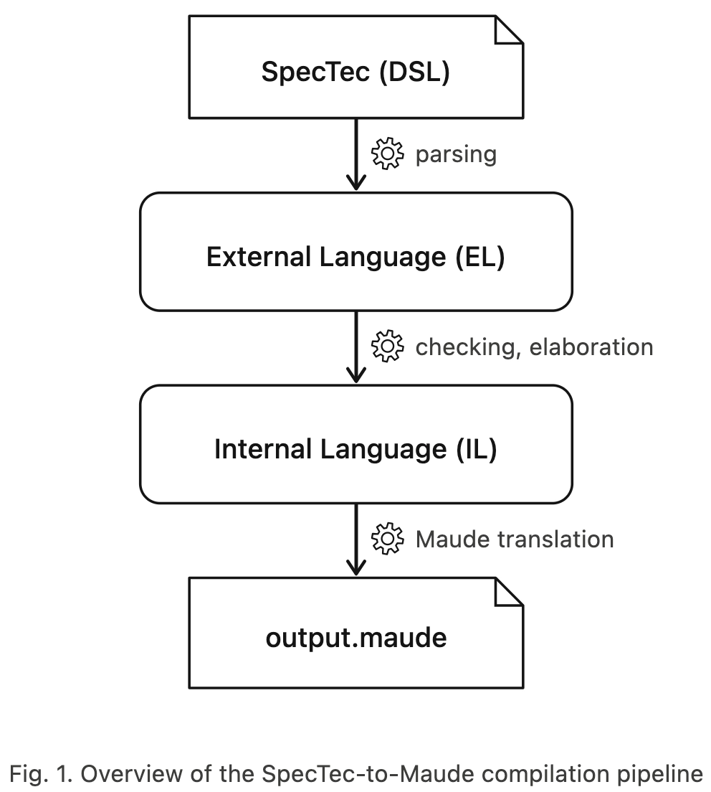

# Spec2Maude Translation Rules

## 1. Architecture Overview

### 1.1 Pipeline



---

### 1.2 Two-Phase Translation

**1단계 : 프리 스캔 (Pre-scan)** (`scan_def`, `build_token_ops`, `build_call_ops`)

전체 AST를 한 번 순회하며 다음 정보들을 수집한다.

| 산출물 (Artifact) | 자료 구조 | 목적 (Purpose) |
|---|---|---|
| 단순 토큰 (Bare tokens) | `SSet.t tokens` | mixfix 패턴에 사용되는 대문자 식별자 (예: `NOP`, `ADD`, `I32`) |
| 생성자 이름 (Constructor names) | `SSet.t ctors` | `VariantT` 케이스를 통해 선언된 이름들 (중복을 막기 위해 단순 토큰 집합에서는 제외됨) |
| 호출 시그니처 (Call signatures) | `SIPairSet.t calls` | 선언되지 않은 헬퍼 함수들을 위한 (함수명, 인자 개수) 쌍 (인자 개수를 통해 Maude `op` (인자 부분 `_`) 를 자동 생성해줌) |
| 불리언 문맥 호출 (Bool-context calls) | `SSet.t bool_calls` | 조건문에 쓰인 함수 수집 후, 해당 함수의 반환 타입을 `BOOL`로 지정해줌 |
| 선언된 함수 (Declared functions) | `SSet.t dec_funcs` | 함수 호출 시 이미 선언 시에 한 `op` 선언을 중복으로 안함 |

**2단계: 변환 (Translation)** (`translate_definition`)

각 AST 노드는 해당하는 핸들러(`translate_typd`, `translate_decd`, `translate_reld`)로 전달되어 Maude 소스 텍스트를 생성한다.

마지막 재정렬(reordering) 패스에서 선언부(`op`, `var`, `subsort`)와 방정식부(`eq`, `ceq`)를 분리하여, 출력 파일의 모든 선언부가 방정식부보다 먼저 위치하도록 배치한다.

---

### 1.3 `texpr` 레코드 : Pure Functional State

```ocaml
type texpr = { text : string; vars : string list }
```

모든 표현식(expression) 변환은 다음을 포함하는 `texpr` 레코드를 반환한다.

- **`text`**: 생성된 Maude 소스 코드 조각
- **`vars`**: AST 순회 중 발견된 변수명 리스트

이를 통해 표현식을 변환할 때 전역 가변 누산기(global mutable accumulator)를 사용할 필요가 사라진다. 변수들은 아래의 콤비네이터들을 통해 상위로 전달(propagate)된다.

```ocaml
tconcat : string → texpr list → texpr       (* 구분자로 연결 *)
tmap    : (string → string) → texpr → texpr (* 텍스트만 변환 *)
tjoin2  : (string → string → string) → texpr → texpr → texpr
```

> **💡 예시 : `BinE(AddOp, VarE "a", VarE "b")` 변환**
>
> **Step 1**: 왼쪽 자식 노드 `VarE("a")` 변환  
> 전역 변수를 건드리는 대신, 자기 자신이 발견한 변수를 `texpr` 레코드에 담아서 위로 던진다.  
> → 반환값: `{ text = "A"; vars = ["A"] }`
>
> **Step 2**: 오른쪽 자식 노드 `VarE("b")` 변환  
> → 반환값: `{ text = "B"; vars = ["B"] }`
>
> **Step 3**: 부모 노드 `BinE(AddOp, ...)` 변환 (콤비네이터)  
> 부모 노드는 밑에서 올라온 두 개의 `texpr`을 받아 `tjoin2`로 하나의 큰 `texpr`로 합친다.  
> → 최종 반환값: `{ text = "A + B"; vars = ["A", "B"] }`
>
> **함수들의 역할:**
> - `tjoin2` : `a + b` 처럼 항상 2개인 이항 연산 처리
> - `tmap` : `(a)` 나 `-a` 처럼 하나의 식을 괄호로 감싸거나 부호를 붙일 때
> - `tconcat` : `f(a, b, c, ...)` 처럼 인자가 몇 개일지 모르는 리스트를 콤마(`,`)나 공백으로 이어 붙일 때

---

### 1.4 Declaration Management

변수 및 연산자의 중복 선언 오류를 방지하기 위해 `declared_vars` 해시 테이블을 활용하여 선언 이력을 추적한다. 특히, Maude 헤더에 이미 정의된 기본 변수들은 `init_declared_vars()`를 통해 사전에 등록(초기화)함으로써 중복 방출을 차단한다.

---

## 2. Formal Translation Rules

다음 규칙들은 SpecTec IL AST 노드에서 Maude 선언 및 방정식으로의 매핑을 정의한다.

**표기법**: ` AST_node  ⟹ Maude_output`

여기서 `...`는 변환 함수를, `⟹`는 "생성한다(produces)"를 의미한다.

---

### 2.1 syntax (TypD)

```
[[ TypD (id, params, insts) ]] =>

    op sanitize(id) : WasmTerminal^|params| -> WasmType [ctor] .

    insts 내의 각 InstD(binders, args, deftyp)에 대해 :

        --- Type_id : 부모 타입 이름 (예: "numtype" 또는 파라미터가 있다면 "binop(NT)")
        let Type_id = id(binders)

        let binder_conds = binders에서 추출한 타입 검사식들 (예: is-type(NT, Inn))

        if deftyp == VariantT(cases) :

            cases 내의 각 (mixop, (_, case_typ, prems), _)에 대해 :

                let N = |case_typ의 파라미터 개수|

                --- 자식 파라미터 조건 (Data-carrying일 때만 생성)
                let param_conds = is-type(V_1, S_1) and ... and is-type(V_N, S_N)

                let RHS = (binder_conds 와 param_conds 를 and 로 연결한 문자열). 비어있으면 "true"

                --- [패턴 1] 단순 키워드 (인자 없음, N = 0)
                if N == 0 and prems == empty :
                    => op sanitize(mixop) : -> WasmTerminal [ctor] .
                       eq is-type(sanitize(mixop), Type_id) = RHS .

                --- [패턴 2] 인자 포함 (Data-carrying, N > 0)
                else if N > 0 and prems == empty and OptT ∉ case_typ :
                    => op sanitize(mixop) _^N : WasmTerminal^N -> WasmTerminal [ctor] .
                       eq is-type(sanitize(mixop) V_1 ... V_N, Type_id) = RHS .
                            --- V_i (변수명)   : 해당 파라미터의 원래 타입 이름을 대문자화하고 카운터를 붙임
                            ---                  (예: numtype -> NUMTYPE1)
                            --- S_i (검사 타입) : Wasm의 종속 타입(Dependent Type) 특성 반영.
                            ---                  만약 S_i가 앞선 파라미터에 종속된다면, 치환된 V_i를 포함함
                            ---                  (예: num(NUMTYPE1))

                --- [패턴 3] optional parameter (case_typ에 IterT(_, Opt)가 포함된 경우)
                --- 각 옵셔널 파라미터 자리를 'eps'로 치환한 보조 방정식 추가
                    --- ex :
                        --- spectec : syntax instr = | IF blocktype? | ...
                        --- Maude : eq is-type(IF BLOCKTYPE1, instr) = is-type(BLOCKTYPE1, blocktype) .
                        ---         에서 BLOCKTYPE1을 eps로 치환 -> eq is-type(IF eps, instr) = true .

                --- [패턴 4] 전제조건 있음 (prems ≠ ∅)
                else if prems ≠ ∅ :
                    => ceq is-type(i_var, Type_id) = true if (binder_conds) and (conditions) .

        if deftyp == AliasT(typ) :
            => eq is-type(T, Type_id) = is-type(T, translate_typ(typ)) .

        if deftyp == StructT(fields) :
            => eq is-type({item('F1, V1); ... ; item('Fn, Vn)}, Type_id)
                = is-type(V1, S1) and ... and is-type(Vn, Sn) .
```

---

### 2.2 def (DecD)

```
[[ DecD(id, params, result_typ, insts) ]] =>

    let fn = "$" ^ sanitize(id)

    op fn : WasmTerminal^|params| -> ret_sort .
    --- ret_sort = result_typ이 Bool이거나 모든 RHS가 불리언 형태면 "Bool"
    ---            (모든 RHS가 불리언 형태 ex : def $is_even(n : u32) = (n % 2 == 0))
    ---          | result_typ이 IterT(_, List|List1)이면 "WasmTerminals"
    ---          | 그 외에는 "WasmTerminal"

    insts 내의 각 DefD(binders, lhs_args, rhs, prems)에 대해 :

        --- vm (Var Map) : SpecTec 변수를 Maude 변수로 바꿔주는 '변환 사전'
        --- (ex : "c"라는 변수가 0번 규칙에서 나오면 "CONST0-C"로, 1번 규칙이면 "CONST1-C"로
        ---  이름표를 붙여서 겹치지 않게 해줌)
        vm = binder_to_var_map(prefix, eq_idx, binders)
        --- prefix : id의 대문자 / eq_idx : 함수 내의 insts 중 몇 번째인지 나타내는 idx

        LHS = fn(translate_exp(lhs_args, vm))
        RHS = translate_exp(rhs, vm)
        COND = binder_type_conds(binders) and translate_prem(prems)

        bound = vars in LHS  => vars 선언
        free  = vars only in RHS/COND  => op 상수 선언 (스콜렘화)

        if COND == empty: eq LHS = RHS [owise?] .
        else: ceq LHS = RHS if COND [owise?] .
```

---

### 2.3 Rule (RelD)

```
[[ RelD(id, _, _, rules) ]] =>

    let rel_name = sanitize(id)

    op rel_name : WasmTerminal^arity -> Bool .
    --- arity : rule이 받는 인자의 개수

    rules 내의 각 RuleD(case_id, binders, _, conclusion, prems)에 대해:

        vm = binder_to_var_map(rel_prefix-case_prefix, rule_idx, binders)
        ARGS = translate_exp(conclusion, vm)   --- LHS, RHS 콤마 연결 (LHS ~> RHS)
        COND = binder_type_conds(binders) and translate_prem(prems)

        bound = vars in conclusion  => vars 선언
        free  = vars only in prems  => op 상수 선언

        if COND == empty: eq rel_name(ARGS) = true .
        else: ceq rel_name(ARGS) = true if COND .
```

> **💡 혁순선배 로직과의 차이**
>
> **SpecTec 원문:**
> ```
> rule Step_pure/binop-val:
>   (CONST nt c_1) (CONST nt c_2) (BINOP nt binop)  ~>  (CONST nt c)
>   -- if c <- $binop_(nt, binop, c_1, c_2)
> ```
> *의미: CONST 2개랑 BINOP 1개가 연달아 있으면, 그걸 계산해서 하나의 CONST로 바꿈*
>
> ---
>
> **전제 조건 & 상태(Context)에서의 차이**
>
> **선배의 수동 변환 코드** — `⇒ (상태가 변한다)` 기호를 사용:
>
> ```maude
> crl [binop-val] : stage:(
>     STATE_BINOP_VAL ; (VALS (CONST NT_BINOP_VAL C_1_BINOP_VAL)
>                             (CONST NT_BINOP_VAL C_2_BINOP_VAL)
>                             (BINOP NT_BINOP_VAL BINOP_BINOP_VAL) INSTRS)
>    ) => stage:(
>    STATE_BINOP_VAL ; (VALS (CONST NT_BINOP_VAL C_BINOP_VAL) INSTRS)
>    )
> ```
>
> **문제점**: SpecTec 원문에는 `STATE_BINOP_VAL`, `VALS`, `INSTRS` 같은 단어가 단 한 개도 없음.
> 그런데 선배는 "실제로 프로그램이 굴러가려면 메모리도 있어야 하고, 뒤에 다른 명령어도 있겠지?"라고 상상해서
> 가짜 환경(Context)을 강제로 끼워 넣음 → 명세서 원본의 형태가 심하게 훼손됨.
>
> **나의 자동 변환 코드** — `ceq … = true` 기호를 사용:
>
> ```maude
> ceq step-pure (
>       (CONST STEP_PURE-BINOP-VAL-WNT STEP_PURE-BINOP-VAL-WC1)
>       (CONST STEP_PURE-BINOP-VAL-WNT STEP_PURE-BINOP-VAL-WC2)
>       (BINOP STEP_PURE-BINOP-VAL-WNT STEP_PURE-BINOP-VAL-WBINOP) ,
>       (CONST STEP_PURE-BINOP-VAL-WNT STEP_PURE-BINOP-VAL-WC)
>     ) = true
> ```
>
> **잘한 점**: 원본 AST 구조를 100% 정직하게 그대로 옮겨온 완벽한 변환.
>
> ---
>
> **조건문(if 절)에서의 불필요한 검사**
>
> **선배의 수동 변환 코드:**
> ```maude
> if typecheck(STATE_BINOP_VAL, state) /\
>    typecheck(NT_BINOP_VAL, numtype) /\
>    typecheck(C_1_BINOP_VAL, num-(NT_BINOP_VAL)) /\
>    typecheck(C_2_BINOP_VAL, num-(NT_BINOP_VAL)) /\
>    typecheck(BINOP_BINOP_VAL, binop-(NT_BINOP_VAL)) /\
>    C_BINOP_VAL := $binop-(NT_BINOP_VAL, BINOP_BINOP_VAL, C_1_BINOP_VAL, C_2_BINOP_VAL) .
> ```
>
> **문제점**: 가장 앞에 있는 `typecheck(STATE_BINOP_VAL, state)`는 순수 연산 규칙에서 굳이 안 해도 될 검사.
> 사람이 억지로 끼워 넣어서 코드가 무거워짐.
>
> **나의 자동 변환 코드:**
> ```maude
> if is-type(STEP_PURE-BINOP-VAL-WNT, numtype) and
>    is-type(STEP_PURE-BINOP-VAL-WC1, lit(STEP_PURE-BINOP-VAL-WNT)) and
>    is-type(STEP_PURE-BINOP-VAL-WC2, lit(STEP_PURE-BINOP-VAL-WNT)) and
>    is-type(STEP_PURE-BINOP-VAL-WBINOP, binop) and
>    STEP_PURE-BINOP-VAL-WC <- $binop_(STEP_PURE-BINOP-VAL-WNT,
>                                      STEP_PURE-BINOP-VAL-WBINOP,
>                                      STEP_PURE-BINOP-VAL-WC1,
>                                      STEP_PURE-BINOP-VAL-WC2) .
> ```
>
> **잘한 점**: 변환기가 AST에서 추출한 변수들에 대해서만 정확하게 `is-type` 검사를 수행함.
>
> ---
>
> **핵심 : 스택 머신의 구현 위치 차이**
>
> - **혁순선배** : 번역된 코드 한가운데에 스택 구조(`VALS`, `INSTRS`)를 욱여넣음.
>   Wasm 명세가 바뀌면 사람이 일일이 스택 구조를 다시 손으로 짜서 맞춰야 함.
>
> - **나의 방식** : 변환된 코드(`output.maude`)에는 순수하게 수학 공식(`ceq`)만 남겨두고,
>   스택 머신을 돌리는 역할은 완전히 별도의 파일(`wasm-exec.maude`)로 분리.
>
> ```maude
> --- BINOP: pop two values, compute, push result
>   crl [binop] :
>     run(push(V2, push(V1, S)), wi(BINOP NT BO) R)
>     => run(push($binop(NT, BO, V1, V2), S), R)
>     if is-type(NT, Inn) = true .
> ```
>
> - **선배의 방식 (일체형)**: 수학 연산과 스택 머신을 한 덩어리로 통째로 용접. 엔진만 바꾸고 싶어도 차를 다 부숴야 함.
> - **나의 방식 (분리형)**: 변환기는 수학 연산만 찍어냄. 스택 엔진은 따로 만들어서 수학 연산만 끼워 넣게 만듦.

---

### 2.4 Translation Rules Summary

| Category | SpecTec (Input) | IL (AST) | Maude (Output) |
|---|---|---|---|
| 단순 합타입 | `syntax T = C` | `TypD("T", [], [InstD(..., VariantT([("C", ..., [], ...)]))])` | `op C : -> WasmTerminal [ctor] .`<br>`eq is-type(C, T) = true .` |
| 인자 포함 합타입 | `syntax T = C P` | `TypD("T", ..., VariantT([("C", ..., [P], ...)]))` | `op C_ : WasmTerminal -> WasmTerminal [ctor] .`<br>`eq is-type(C V, T) = is-type(V, P) .` |
| 타입 별칭 | `syntax T1 = T2` | `TypD("T1", [], [InstD(..., AliasT(T2))])` | `eq is-type(V, T1) = is-type(V, T2) .` |
| 구조체 타입 | `syntax T = {f: P}` | `TypD("T", ..., StructT([("f", P)]))` | `eq is-type({item('f, V)}, T) = is-type(V, P) .` |
| 단순 함수 정의 | `def $f(x) = e` | `DecD("f", ..., [DefD([], [VarE "x"], e_ast, [])])` | `op $f : WasmTerminal -> WasmTerminal .`<br>`eq $f(X) = translate(e) .` |
| 종속 타입 함수 | `def $f(x: T1, y: T2(x)) = e` | `DecD("f", ..., [DefD(binders, lhs, e_ast, [])])` | `vars X Y : WasmTerminal .`<br>`ceq $f(X, Y) = translate(e)`<br>&nbsp;&nbsp;`if is-type(X, T1) and is-type(Y, T2(X)) .` |
| 옵셔널 파라미터 | `syntax T = C P?` | `TypD(..., VariantT(..., [IterT(P, Opt)], ...))` | `eq is-type(C V, T) = is-type(V, P) .`<br>`eq is-type(C eps, T) = true .` |
| 관계 및 전이 규칙 | `rule id/case_id:`<br>`LHS ~> RHS`<br>`-- if prems` | `RelD("id", _, _, [`<br>&nbsp;&nbsp;`RuleD("case_id", binders, _,`<br>&nbsp;&nbsp;`TupE [LHS, RHS], prems)`<br>`])` | `op $id : WasmTerminal^arity -> Bool .`<br>`vars PREFIX-BOUND_VARS : WasmTerminal .`<br>`op PREFIX-FREE_VARS : -> WasmTerminal .`<br>`ceq $id(ARGS) = true`<br>&nbsp;&nbsp;`if type_conds and translate(prems) .` |

---

## 3. Helper Rules

### 3.1 `translate_exp`

SpecTec 표현식을 Maude 텍스트로 변환한다. `ctx ∈ {BoolCtx, TermCtx}`에 따라 Boolean 래핑이 달라진다.

```
[[ translate_exp(ctx, e, vm) ]] =>
    match e:
        VarE id:
            vm 조회 → mapped
            else if "true"/"false" → wrap_bool(ctx, ...)
            else if token-like → sanitize(id)
            else if suffixed → resolve_suffixed → mapped
            else → to_var_name(id)

        NumE n: Z.to_string(n) 또는 "num/den" 또는 "%.17g"
        BoolE b: wrap_bool(ctx, "true"/"false")
        TextE s: "\"" ^ s ^ "\""

        CaseE(mixop, inner):
            if mixop = "$" or "%" or "" → translate_exp(inner)
            else: sections와 args 교차 배치 (sect1 V1 sect2 V2 ...)

        CallE(id, args): $sanitize(id)(translate_arg(args))

        BinE(op, _, e1, e2): (translate_exp(e1) op_str translate_exp(e2))
        CmpE(op, _, e1, e2): wrap_bool(ctx, (e1 op e2))
        UnE(NotOp, _, e1): wrap_bool(ctx, not(e1))
        UnE(MinusOp, _, e1): - ( e1 )
        UnE(PlusOp, _, e1): e1

        StrE fields: {item('F1,v1) ; item('F2,v2) ; ...}
        DotE(e, atom): value('ATOM, translate_exp(e))

        TupE [] | ListE []: eps
        TupE [e1]: translate_exp(e1)
        TupE el | ListE el: translate_exp(e1) " " ... " " translate_exp(en)

        IfE(c,e1,e2): if translate_exp(BoolCtx,c) then translate_exp(e1) else translate_exp(e2) fi
        MemE(e1,e2): wrap_bool(ctx, (e1 <- e2))
        CompE(e1,e2): merge ( e1 , e2 )
        CatE(e1,e2): e1 e2
        LenE(e1): len ( e1 )
        IdxE(e1,e2): index ( e1 , e2 )
        SliceE(e1,e2,e3): slice ( e1 , e2 , e3 )
        UpdE(e1,path,e2): ( e1 [ path <- e2 ] )
        ExtE(e1,path,e2): ( e1 [ path =++ e2 ] )

        IterE(VarE id, (List|List1|Opt, _)): vm[id^*|^+|^?] 또는 to_var_name(id+suffix)
        OptE None: eps
        OptE Some e1 | TheE e1 | LiftE e1: translate_exp(e1)
        CvtE | SubE | ProjE | UncaseE: translate_exp(inner)
```

---

### 3.2 `translate_prem`

| Prem 노드 | 변환 |
|---|---|
| `IfPr e` | `translate_exp(BoolCtx, e)` |
| `RulePr(id, _, e)` | `sanitize(id)(translate_exp(e))` |
| `LetPr(e1, e2, _)` | `(e1 == e2)` |
| `ElsePr` | `owise` (속성으로 처리) |
| `IterPr(inner, _)` | `translate_prem(inner)` |
| `NegPr inner` | `translate_prem(inner)` |

---

### 3.3 `translate_arg`

| Arg 노드 | 변환 |
|---|---|
| `ExpA e` | `translate_exp(TermCtx, e)` |
| `TypA t` | `translate_typ(t)` |
| `DefA _` | `eps` |
| `GramA _` | `eps` |

---

### 3.4 `translate_typ`

| Typ 노드 | 변환 |
|---|---|
| `VarT(id, [])` | `sanitize(id)` 또는 `vm[id]` |
| `VarT(id, args)` | `sanitize(id)(arg1, arg2, ...)` |
| `IterT(inner, _)` | `translate_typ(inner)` |
| 기타 | `WasmType` |

---

### 3.5 `sanitize`

| 조건 | 변환 |
|---|---|
| `"_"` | `any` |
| 단일 문자, 비알파벳 시작, Maude 키워드 | `w-` prefix |
| `. _ ' * + ?` | `--` |
| digit 시퀀스 | `N` + digit |
| 후행 하이픈 | 제거 |

예: `numtype_2` → `numtypeN2`, `$` → `w-$`

---

### 3.6 `wrap_bool` (Boolean 래핑)

```
wrap_bool(BoolCtx, s) = s
wrap_bool(TermCtx, s) = w-bool ( s )
```

- **Boolean 맥락 (`BoolCtx`)**: `IfPr`, `and`/`or`/`implies`, `not`, Bool 반환 함수 RHS
- **Term 맥락 (`TermCtx`)**: 그 외

---

## 4. Sort 계측 구조 및 파싱 모호성 분석

### 4.1 The Flat Sort Lattice

생성된 명세는 의도적으로 평탄한 소트 계층 구조를 사용한다.

```
       WasmTerminals
       /          \
WasmTerminal    (assoc juxtaposition _ _)
  /   |   \
Int  Nat  WasmType
```

```maude
subsort Int < WasmTerminal .
subsort Nat < WasmTerminal .
subsort WasmType < WasmTerminal .
subsort WasmTypes < WasmTerminals .
```

---

### 4.2 Source of Ambiguity

항(term)이 여러 소트 수준에서 파싱될 수 있을 때, Maude는 `Warning: multiple distinct parses` 경고를 보고한다. 이는 두 가지 메커니즘에서 발생한다.

**메커니즘 A : 오버로딩된 상수 (Overloaded Constants)**

`NOP`과 같은 SpecTec 생성자는 두 가지 방식으로 모두 선언될 수 있다.

- 토큰으로 선언: `ops NOP : → WasmTerminal [ctor] .`
- Variant 케이스로 선언: `op NOP : → WasmTerminal [ctor] .`

두 선언 모두 동일한 연산자 시그니처를 생성한다. 두 구문 트리가 동일한 항을 나타냄에도 불구하고 Maude는 이를 두 개의 별개 파싱 대안으로 간주한다.

**메커니즘 B: 하위 소트 다형성 (Subsort Polymorphism)**

정수 리터럴 `42`는 다음과 같이 파싱될 수 있다.

- `42 : Nat` (내장 타입을 통해)
- `42 : Int` (`subsort Nat < Int`를 통해)
- `42 : WasmTerminal` (`subsort Int < WasmTerminal`을 통해)

`is-type(42, num(I32))`의 인자로 `42`가 등장할 때, 파서는 각 소트 수준에서 유효한 파싱 결과를 본다.

---

### 4.3 Confluence Argument

**Claim**: All ambiguous parses of a well-formed term in SPECTEC-CORE yield identical rewriting behavior.

**Proof sketch:**

1. **Sort Monotonicity.** For any operator `f : S₁ → S₂` with `S₁ ⊂ S₁'`, if a term `t` has sort `S₁`, then `f(t)` computed at sort `S₁` equals `f(t)` computed at sort `S₁'`. This holds because all equations in SPECTEC-CORE are defined at the maximal sort (`WasmTerminal` / `WasmTerminals`), and Maude's equational matching operates at the kind level `[WasmTerminal]`, which subsumes all subsorts.

2. **Operator Idempotence.** Duplicate `op` declarations for the same name with identical signature and attributes produce the same constructor in Maude's internal representation. The two parse trees are syntactically distinct but semantically identical — they denote the same term in the term algebra `T_Σ/E`.

3. **Equational Convergence.** All equations (`eq`/`ceq`) pattern-match at the kind level. A conditional equation `ceq f(X) = rhs if cond` will match any term of kind `[WasmTerminal]` regardless of which subsort parse was chosen. Since the matched substitution `σ` maps variables to the same ground values in all parses, the rewriting result is unique.

4. **Church-Rosser Property.** Maude's equational engine is Church-Rosser modulo the declared axioms (associativity, identity). Since our equations do not introduce competing rewrites for the same LHS pattern (the flat sort hierarchy prevents sort-based equation selection), the system is confluent.

**Practical Implication**: The multiple distinct parses warnings are cosmetic artifacts of the flat encoding. They do not affect the correctness of reductions, as verified empirically by the 59 equational tests and 12 rewrite-rule executions, all of which produce deterministic, expected results.

---

### 4.4 Why a Flat Hierarchy?

A richer sort hierarchy (e.g., `sort numtype . subsort numtype < valtype . subsort valtype < WasmTerminal .`) would eliminate many ambiguity warnings but would require:

- Complete sort inference from the SpecTec type system, which uses dependent types and type-indexed families not directly expressible in Maude's order-sorted algebra.
- Cross-cutting subsort declarations for Wasm's overlapping type categories (e.g., `I32` is simultaneously a `numtype`, an `Inn`, an `addrtype`, and a `valtype`).

The flat hierarchy trades parsing precision for translation generality: any SpecTec type maps uniformly to `WasmTerminal`, and type membership is encoded equationally via `is-type` predicates. This is a deliberate design choice that prioritizes completeness of the translation over elimination of advisory warnings.

---

## Appendix A : Examples

### A.1 syntax (TypD)

#### VariantT - 패턴 1: 단순 키워드 (`numtype`)

**SpecTec:**
```
syntax numtype = | I32 | I64
```

**IL:**
```ocaml
TypD (id "numtype", [], [
  InstD ([], [], VariantT [
    ("I32", ([], TupT [], []), []);
    ("I64", ([], TupT [], []), [])
  ])
]);
```

**Maude:**
```maude
op numtype : -> WasmType [ctor] .
op I32 : -> WasmTerminal [ctor] .
eq is-type(I32, numtype) = true .
op I64 : -> WasmTerminal [ctor] .
eq is-type(I64, numtype) = true .
```

---

#### VariantT - 패턴 2: 인자 포함 (`CONST`)

**SpecTec:**
```
syntax instr = | CONST numtype num_(numtype)
```

**IL:**
```ocaml
TypD ("instr", [], [
    InstD ([], [], VariantT [
      (["CONST%%"], ([], TupT [
        (dummy_lbl, VarT ("numtype", []));
        (dummy_lbl, VarT ("num_", [ TypA (VarT ("numtype", [])) ]))
      ], []), []);
    ])
  ]);
```

**Maude:**
```maude
op CONST _ _ : WasmTerminal WasmTerminal -> WasmTerminal [ctor] .
eq is-type (CONST NUMTYPE1 NUM1, val)
    = is-type (NUMTYPE1, numtype) and is-type (NUM1, num(NUMTYPE1)) .
```

---

#### VariantT - 패턴 2: 파라미터 타입 (`binop`)

**SpecTec:**
```
syntax binop_(Inn) = | ADD | SUB | ...
```

**IL:**
```ocaml
TypD ("binop_",
    [ TypP "numtype" ],
    [ InstD (
        [ ExpB ("Inn", VarT ("numtype", [])) ],
        [ TypA (VarT ("Inn", [])) ],
        VariantT [
          (["ADD"], ([], TupT [], []), []);
          (["SUB"], ([], TupT [], []), []);
        ]
    )]
  );
```

**Maude:**
```maude
op binop : WasmTerminal -> WasmType [ctor] .
op ADD : -> WasmTerminal [ctor] .
eq is-type(ADD, binop(NT)) = is-type(NT, Inn) .
op SUB : -> WasmTerminal [ctor] .
eq is-type(SUB, binop(NT)) = is-type(NT, Inn) .
```

---

#### AliasT

**SpecTec:**
```
syntax idx = u32
```

**IL:**
```ocaml
TypD (id "idx", [], [InstD ([], [], AliasT (VarT (id "u32", [])))]);
```

**Maude:**
```maude
op idx : -> WasmType .
eq is-type(T, idx) = is-type(T, u32) .
```

---

#### StructT

**SpecTec:**
```
syntax memarg = {ALIGN u32, OFFSET u32}
```

**IL:**
```ocaml
TypD (
  "memarg",
  [],
  [
    InstD (
      [],
      [],
      StructT [
        ("ALIGN", VarT ("u32", []));
        ("OFFSET", VarT ("u64", []))
      ]
    )
  ]
)
```

**Maude:**
```maude
eq is-type({item('ALIGN, V1) ; item('OFFSET, V2)}, memarg)
   = is-type(V1, u32) and is-type(V2, u64) .
```

---

### A.2 def (DecD)

#### 단순 `eq` (`$const`)

**SpecTec:**
```
def $const(numtype, c) = (CONST numtype c)
```

**IL:**
```ocaml
DecD (
  "const",

  [
    ExpP ("consttype", VarT ("consttype", []));
    ExpP ("lit_", VarT ("lit_", [VarE "consttype"]))
  ],

  VarT ("instr", []),

  [
    DefD (
      [
        ExpB ("numtype", VarT ("numtype", []));
        ExpB ("c", VarT ("lit", [VarE "numtype"]))
      ],

      [
        ExpA (VarE "numtype");
        ExpA (VarE "c")
      ],

      AppE ("CONST", [VarE "numtype"; VarE "c"]),

      []
    );
  ]
)
```

**Maude:**
```maude
ceq $const ( CONST0-NUMTYPE, CONST0-WC ) = CONST CONST0-NUMTYPE CONST0-WC
    if is-type ( CONST0-NUMTYPE , numtype ) and is-type ( CONST0-WC , lit ( CONST0-NUMTYPE ) ) .
```

---

#### `ceq` (`$iadd`)

**SpecTec:**
```
def $iadd_(N, i_1, i_2) = $((i_1 + i_2) \ 2^N)
```

**IL:**
```ocaml
DecD (
  "iadd_",

  [
    ExpP ("N", VarT ("N", []));
    ExpP ("i_1", VarT ("iN", [VarE "N"]));
    ExpP ("i_2", VarT ("iN", [VarE "N"]))
  ],

  VarT ("iN", [VarE "N"]),

  [
    DefD (
      [
        ExpB ("N", VarT ("N", []));
        ExpB ("i_1", VarT ("iN", [VarE "N"]));
        ExpB ("i_2", VarT ("iN", [VarE "N"]))
      ],

      [
        ExpA (VarE "N");
        ExpA (VarE "i_1");
        ExpA (VarE "i_2")
      ],

      BinE (Rem,
        BinE (Add, VarE "i_1", VarE "i_2"),
        BinE (Pow,
          NumE 2,
          VarE "N"
        )
      ),

      []
    )
  ]
)
```

**Maude:**
```maude
op $iadd : WasmTerminal WasmTerminal WasmTerminal -> WasmTerminal .

vars IADD0-WN IADD0-IN1 IADD0-IN2 : WasmTerminal .

ceq $iadd ( IADD0-WN , IADD0-IN1 , IADD0-IN2 )
   = ( ( IADD0-IN1 + IADD0-IN2 ) rem ( 2 ^ IADD0-WN ) )
   if is-type ( IADD0-WN , w-N )
  and is-type ( IADD0-IN1 , iN ( IADD0-WN ) )
  and is-type ( IADD0-IN2 , iN ( IADD0-WN ) ) .
```

---

#### `ceq` with premise (`$binop` dispatch)

**SpecTec:**
```
def $binop_(Inn, ADD, i_1, i_2) = $iadd_($sizenn(Inn), i_1, i_2)
```

**IL:**
```ocaml
DecD (
  "binop",

  [
    ExpP ("Inn", VarT ("numtype", []));
    ExpP ("ADD", VarT ("binop", []));
    ExpP ("i_1", VarT ("iN", [AppE ("$size", [VarE "Inn"])]));
    ExpP ("i_2", VarT ("iN", [AppE ("$size", [VarE "Inn"])]))
  ],

  VarT ("iN", [AppE ("$size", [VarE "Inn"])]),

  [
    DefD (
      [
        ExpB ("Inn", VarT ("numtype", []));
        ExpB ("ADD", VarT ("binop", []));
        ExpB ("i_1", VarT ("iN", [AppE ("$size", [VarE "Inn"])]));
        ExpB ("i_2", VarT ("iN", [AppE ("$size", [VarE "Inn"])]))
      ],

      [
        ExpA (VarE "Inn");
        ExpA (VarE "ADD");
        ExpA (VarE "i_1");
        ExpA (VarE "i_2")
      ],

      AppE ("$iadd", [
        AppE ("$size", [VarE "Inn"]);
        VarE "i_1";
        VarE "i_2"
      ]),

      []
    )
  ]
)
```

**Maude:**
```maude
ceq $binop ( BINOP0-INN , ADD , BINOP0-IN1 , BINOP0-IN2 )
   = $iadd ( $sizenn ( BINOP0-INN ) , BINOP0-IN1 , BINOP0-IN2 )
   if is-type ( BINOP0-INN , Inn )
  and is-type ( BINOP0-IN1 , num ( BINOP0-INN ) )
  and is-type ( BINOP0-IN2 , num ( BINOP0-INN ) ) .
```

---

### A.3 rule (RelD)

#### 단순 `eq` (`Step_pure/nop`)

**SpecTec:**
```
rule Step_pure/nop: NOP ~> eps
```

**IL:**
```ocaml
RelD (
  "step_pure",
  [],
  None,
  [
    RuleD (
      "nop",
      [],
      None,
      TupE [
        AppE ("NOP", []);
        AppE ("eps", [])
      ],
      []
    );
  ]
)
```

**Maude:**
```maude
op Step-pure : WasmTerminal WasmTerminal -> Bool .
eq Step-pure ( NOP , eps ) = true .
```

---

#### `ceq` (`Step_pure/binop-val`)

**SpecTec:**
```
rule Step_pure/binop-val:
  (CONST nt c_1) (CONST nt c_2) (BINOP nt binop)  ~>  (CONST nt c)
  -- if c <- $binop_(nt, binop, c_1, c_2)
```

**IL:**
```ocaml
RelD (
  "step_pure",
  [], [],
  [
    RuleD (
      "binop-val",

      [
        ExpB ("nt", VarT ("numtype", []));
        ExpB ("c_1", VarT ("lit", [VarE "nt"]));
        ExpB ("c_2", VarT ("lit", [VarE "nt"]));
        ExpB ("binop", VarT ("binop", []));
        ExpB ("c", VarT ("lit", [VarE "nt"]))
      ],

      None,

      TupE [
        IterE [
          AppE ("CONST", [VarE "nt"; VarE "c_1"]);
          AppE ("CONST", [VarE "nt"; VarE "c_2"]);
          AppE ("BINOP", [VarE "nt"; VarE "binop"])
        ];
        AppE ("CONST", [VarE "nt"; VarE "c"])
      ],

      [
        CallPr ("c", "$binop_", [VarE "nt"; VarE "binop"; VarE "c_1"; VarE "c_2"])
      ]
    )
  ]
)
```

**Maude:**
```maude
op Step-pure : WasmTerminal WasmTerminal -> Bool .

vars STEP_PURE-BINOP-VAL-WNT STEP_PURE-BINOP-VAL-WC1
     STEP_PURE-BINOP-VAL-WC2 STEP_PURE-BINOP-VAL-WBINOP
     STEP_PURE-BINOP-VAL-WC : WasmTerminal .

ceq step-pure (
      (CONST STEP_PURE-BINOP-VAL-WNT STEP_PURE-BINOP-VAL-WC1)
      (CONST STEP_PURE-BINOP-VAL-WNT STEP_PURE-BINOP-VAL-WC2)
      (BINOP STEP_PURE-BINOP-VAL-WNT STEP_PURE-BINOP-VAL-WBINOP) ,
      (CONST STEP_PURE-BINOP-VAL-WNT STEP_PURE-BINOP-VAL-WC)
    ) = true
    if is-type(STEP_PURE-BINOP-VAL-WNT, numtype) and
       is-type(STEP_PURE-BINOP-VAL-WC1, lit(STEP_PURE-BINOP-VAL-WNT)) and
       is-type(STEP_PURE-BINOP-VAL-WC2, lit(STEP_PURE-BINOP-VAL-WNT)) and
       is-type(STEP_PURE-BINOP-VAL-WBINOP, binop) and
       STEP_PURE-BINOP-VAL-WC <- $binop_(STEP_PURE-BINOP-VAL-WNT,
                                         STEP_PURE-BINOP-VAL-WBINOP,
                                         STEP_PURE-BINOP-VAL-WC1,
                                         STEP_PURE-BINOP-VAL-WC2) .
```
